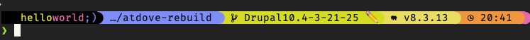

## ✨ helloworld Prompt

A custom, high-style Starship prompt that says hello in the most *visually satisfying* way possible. Built for macOS devs who want **color, clarity, and clean powerline vibes** out of the box.



---

## ⚡ Features

- 🎨 **Multi-colored `helloworld;)` logo**
- 💻 Clean, Powerline-style segments with vibrant transitions
- 🚀 Git status with expressive emoji (✅ ✏️ 🔁 ❌)
- 💡 Language/tool detection for Node.js, Rust, Go, PHP
- ⏳ Command duration (only if >1 min)
- ⌚ Time, status, directory — everything you need at a glance
- 🔥 Nerd Font-compatible with slick dev icons

---

## 🧰 Requirements

Make sure you have the following before installing:

### ✅ Prerequisites

| Tool         | Why                              |
|--------------|-----------------------------------|
| [Homebrew](https://brew.sh) | Package manager for macOS (assumed installed) |
| [Nerd Font](https://www.nerdfonts.com/) | To display icons (Recommended: FiraCode Nerd Font) |
| [Zsh](https://www.zsh.org/) | Prompt runs inside Zsh (macOS default) |
| [Starship](https://starship.rs) | The actual prompt engine (auto-installed) |

### 💡 Optional:

- [iTerm2](https://iterm2.com) for a slick terminal experience
- [FiraCode Nerd Font](https://github.com/ryanoasis/nerd-fonts/releases) for perfect icons
- Set your terminal font to a Nerd Font after install

---

## 🚀 Installation

### 1. Clone and run:

```bash
bash <(curl -s https://raw.githubusercontent.com/YOUR-USERNAME/YOUR-REPO/main/install.sh)
```

This will:

- ✅ Install Starship if not present
- ✅ Set up your full `starship.toml` config
- ✅ Add the prompt to your `~/.zshrc` automatically

---

### 2. Enable Nerd Font in Terminal

- Open **iTerm2** or **Terminal.app**
- Go to Preferences → Profiles → Text → Font
- Choose a **Nerd Font** (e.g. FiraCode Nerd Font)

---

### 3. Reload your terminal:

```bash
source ~/.zshrc
```

You're now running `helloworld ;)` in style.

---

## 🔧 Customization

Want to change colors, icons, or add segments? Just edit:

```bash
~/.config/starship.toml
```

You can tweak everything — even the logo is modular.

---

## 🧠 Credits & Inspiration

- [Starship](https://starship.rs)
- [Starshell](https://github.com/Binary-Eater/starshell)
- Nerd Fonts
