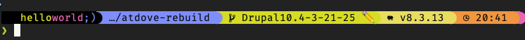

## ✨ Hello World Prompt

A custom, high-style Starship prompt that says hello in the most *visually satisfying* way possible. Built for macOS devs who want **color, clarity, and clean powerline vibes** out of the box.



---

## ⚡ Features

- 🎨 **Multi-colored `helloworld;)` logo**
- 💻 Clean, Powerline-style segments with vibrant transitions
- 🚀 Git status with expressive emoji (✅ ✏️ 🔁 ❌)
- 💡 Language/tool detection for Node.js, Rust, Go, PHP
- ⏳ Command duration (only if >1 min)
- ⌚ Time, status, directory — everything you need at a glance
- 🔥 Nerd Font-compatible with slick dev icons
- ⌨️ Zsh autosuggestions, syntax highlighting & macOS-style key bindings
- 🌐 Auto-syncs `/etc/hosts` for Lando projects on `lando start`

---

## 🧰 Requirements

Make sure you have the following before installing:

### ✅ Prerequisites

| Tool         | Why                              |
|--------------|-----------------------------------|
| [Homebrew](https://brew.sh) | Package manager for macOS (assumed installed) |
| [Nerd Font](https://www.nerdfonts.com/) | To display icons (Recommended: FiraCode Nerd Font) |
| [Zsh](https://www.zsh.org/) | Prompt runs inside Zsh (macOS default) |
| [Starship](https://starship.rs) | The actual prompt engine (auto-installed) |

### 💡 Optional:

- [iTerm2](https://iterm2.com) for a slick terminal experience
- [FiraCode Nerd Font](https://github.com/ryanoasis/nerd-fonts/releases) for perfect icons
- Set your terminal font to a Nerd Font after install

---

## 🚀 Installation

### 1. Clone and run:

```bash
bash <(curl -s https://raw.githubusercontent.com/HelloWorldDevs/starshelloworld-prompt/main/install.sh)
```

This will:

- ✅ Install Starship if not present
- ✅ Install zsh plugins (autosuggestions, syntax-highlighting)
- ✅ Set up your full `starship.toml` config
- ✅ Install shell enhancements + the `lando-hosts` helper
- ✅ Add everything to your `~/.zshrc` automatically

---

### 2. Enable Nerd Font in Terminal

- Open **iTerm2** or **Terminal.app**
- Go to Preferences → Profiles → Text → Font
- Choose a **Nerd Font** (e.g. FiraCode Nerd Font)

---

### 3. Reload your terminal:

```bash
source ~/.zshrc
```

You're now running `helloworld ;)` in style.

---

## 🔧 Customization

Want to change colors, icons, or add segments? Just edit:

```bash
~/.config/starship.toml
```

You can tweak everything — even the logo is modular.

---

## 🐚 Shell Enhancements

The installer also wires up a batch of zsh quality-of-life upgrades, kept in
`~/.config/starshelloworld/helloworld.zsh` and sourced from your `~/.zshrc`:

- **Autosuggestions** — fish-style suggestions from history (`zsh-autosuggestions`)
- **Syntax highlighting** — commands are colored as you type (`zsh-syntax-highlighting`)
- **Tab completion** — case-insensitive, with an arrow-key menu
- **Smarter history** — 50k lines, shared across tabs, deduped
- **Key bindings** — Option+←/→ word jumps, Home/End, ⌥-delete

> In **iTerm2**, also enable **Settings → Profiles → Keys → Key Mappings →
> Presets → Natural Text Editing** so the terminal emits the escape sequences
> these bindings expect.

---

## 🌐 Lando + /etc/hosts

Ships a `lando-hosts` helper (installed to `~/.local/bin`) that keeps
`/etc/hosts` in sync with your Lando project hostnames:

```bash
lando-hosts auto                 # detect hosts from ./.lando.yml and add them
lando-hosts add myapp.test       # add a specific host
lando-hosts list                 # show managed entries
lando-hosts remove myapp.test    # remove a managed entry
```

It also wraps the `lando` command: `lando start`, `lando restart`, and
`lando rebuild` automatically run `lando-hosts auto` first, so a project's
hostnames always resolve locally. Editing `/etc/hosts` needs `sudo`, so you
may be prompted for your password the first time an entry is added.

---

## 🧠 Credits & Inspiration

- [Starship](https://starship.rs)
- [Starshell](https://github.com/Binary-Eater/starshell)
- Nerd Fonts
